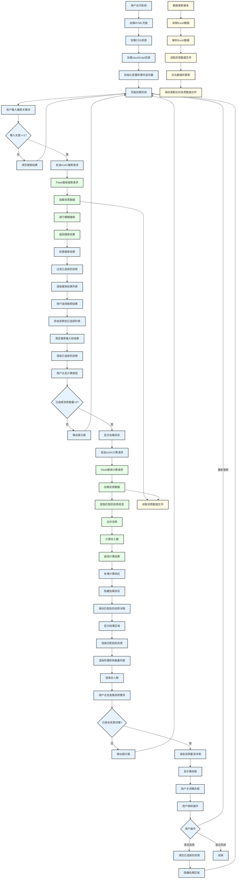
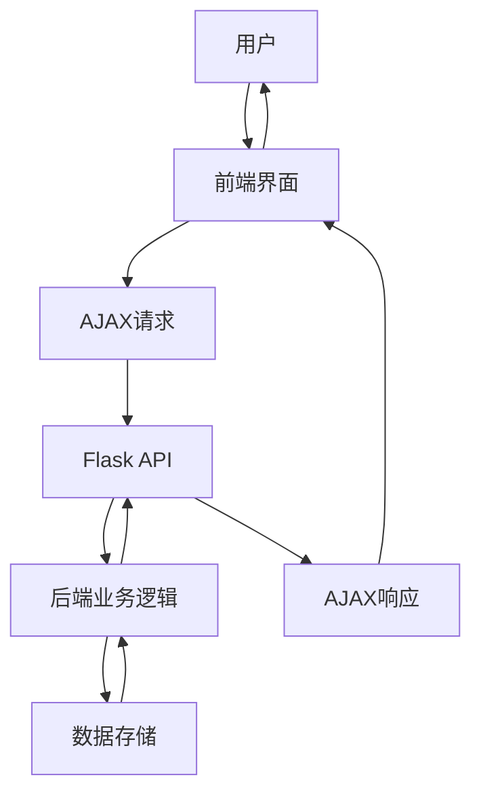

# 前后端交互流程图

## 系统架构概述

本系统采用前后端分离架构，前端使用HTML、CSS和JavaScript实现，后端使用Flask框架实现。前端通过AJAX与后端API进行通信，实现资质搜索、资质选择、职称数量计算和结果展示等功能。

## 流程图说明

- **前端部分**：使用浅蓝色背景（`#E6F3FF`）表示
- **后端部分**：使用浅绿色背景（`#E6FFE6`）表示
- **数据存储**：使用浅黄色背景（`#FFFBE6`）表示

## 详细流程图

## 流程图详细说明

### 1. 系统初始化流程

1. **前端**：用户访问系统，加载HTML、CSS和JavaScript资源
2. **前端**：初始化变量和事件监听器
3. **前端**：页面加载完成，等待用户操作

### 2. 搜索功能流程

1. **前端**：用户输入搜索关键词
2. **前端**：检查输入长度，若>=1则发送AJAX搜索请求到`/api/search`
3. **后端**：Flask接收搜索请求
4. **后端**：调用`load_qualification_data`函数加载资质数据
5. **数据存储**：读取`qualification_data.json`文件
6. **后端**：调用`fuzzy_search`函数进行模糊搜索
7. **后端**：返回搜索结果
8. **前端**：处理搜索结果，过滤已选择的资质
9. **前端**：渲染搜索结果列表
10. **前端**：用户选择搜索结果，添加到已选择列表
11. **前端**：清空搜索输入和结果，渲染已选择的资质

### 3. 计算功能流程

1. **前端**：用户点击"计算所需职称数量"按钮
2. **前端**：检查已选择资质数量，若>0则显示加载状态
3. **前端**：发送AJAX计算请求到`/api/match`
4. **后端**：Flask接收计算请求
5. **后端**：调用`load_qualification_data`函数加载资质数据
6. **数据存储**：读取`qualification_data.json`文件
7. **后端**：获取匹配的资质信息
8. **后端**：调用`merge_qualifications`函数合并资质
9. **后端**：调用`calculate_total_staff`函数计算总人数
10. **后端**：返回计算结果
11. **前端**：处理计算响应，隐藏加载状态
12. **前端**：保存匹配到的资质详情，显示结果区域
13. **前端**：渲染匹配到的资质、所需职称数量列表和总人数

### 4. 详情查看流程

1. **前端**：用户点击"查看资质要求"按钮
2. **前端**：检查是否已保存资质详情，若已保存则渲染资质要求详情
3. **前端**：显示模态框，展示资质的详细要求
4. **前端**：用户关闭模态框，继续操作

### 5. 数据更新流程

1. **数据存储**：运行`update_qualification_data.py`脚本
2. **数据存储**：读取`zivi_data.xlsx`文件
3. **数据存储**：解析Excel数据
4. **数据存储**：读取`qualification_data.json`文件
5. **数据存储**：对比数据并更新
6. **数据存储**：保存更新后的`qualification_data.json`文件

## 前后端交互API

| API端点 | 请求方法 | 请求参数 | 响应内容 | 功能描述 |
|---------|----------|----------|----------|----------|
| `/api/search` | GET | `q`：搜索关键词 | 匹配的资质名称列表 | 模糊搜索资质 |
| `/api/match` | POST | `qualifications`：已选择的资质列表 | 匹配结果、所需职称数量、总人数 | 计算所需职称数量 |
| `/api/qualifications` | GET | 无 | 所有资质名称列表 | 获取所有资质（当前未使用） |

## 数据流向

## 系统特点

1. **前后端分离**：前端和后端独立开发、部署，提高开发效率和系统可维护性
2. **RESTful API设计**：后端提供RESTful API，便于前端调用和第三方系统集成
3. **异步通信**：使用AJAX进行异步通信，提高用户体验
4. **模块化设计**：前端和后端均采用模块化设计，便于功能扩展和代码维护
5. **响应式设计**：前端采用响应式设计，适配不同设备尺寸

## 技术栈

| 类别 | 技术 | 版本 | 用途 |
|------|------|------|------|
| 前端 | HTML5 | 最新 | 页面结构 |
| 前端 | CSS3 | 最新 | 页面样式 |
| 前端 | JavaScript | ES6+ | 交互逻辑 |
| 前端 | Bootstrap | 5.3+ | UI组件库 |
| 后端 | Python | 3.12+ | 主要开发语言 |
| 后端 | Flask | 最新 | Web服务框架 |
| 数据处理 | Pandas | 最新 | Excel数据处理 |
| 数据存储 | JSON | - | 资质数据存储 |
| 数据存储 | Excel | - | 资质数据源 |

## 优化建议

1. **添加缓存机制**：在后端添加缓存机制，减少对文件系统的访问，提高响应速度
2. **使用CDN加速**：将静态资源部署到CDN，提高资源加载速度
3. **添加请求限流**：防止恶意请求导致系统过载
4. **使用HTTPS**：确保数据传输的安全性
5. **添加日志记录**：记录系统运行日志，便于调试和监控
6. **使用WebSocket**：对于需要实时更新的数据，考虑使用WebSocket替代AJAX
7. **优化数据库访问**：如果未来数据量增大，考虑使用数据库替代JSON文件存储

## 总结

本流程图详细展示了系统的前后端交互流程，使用不同的背景色区分了前端、后端和数据存储部分。通过这个流程图，可以清晰地了解系统的整体架构和工作原理，有助于后续的系统维护和优化。

该流程图涵盖了系统的主要功能流程，包括搜索功能、计算功能、详情查看功能和数据更新功能，完整地展示了用户从访问系统到查看结果的整个过程。