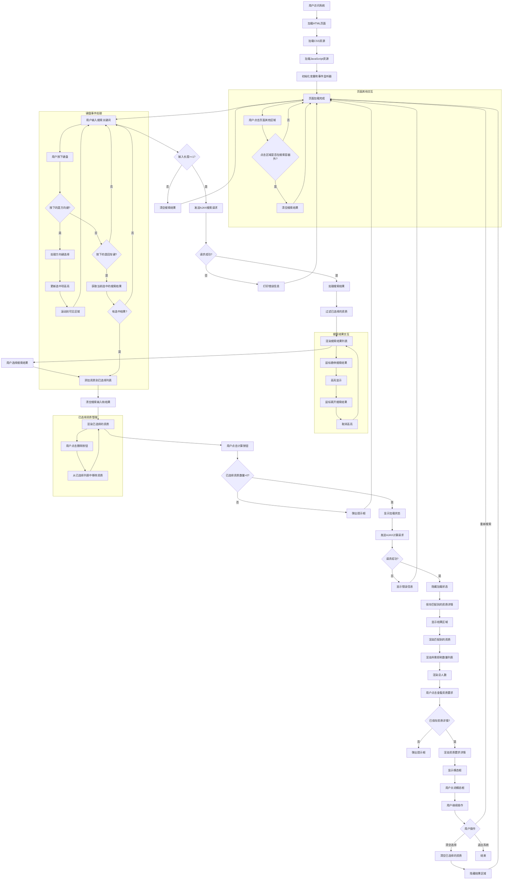
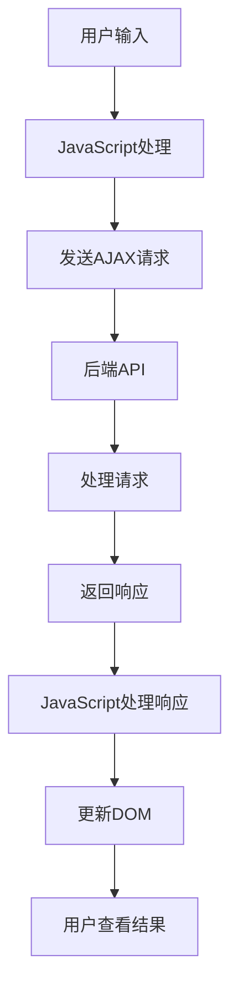

# 前端流程图

## 前端架构概述

前端采用纯HTML、CSS和JavaScript实现，使用Bootstrap作为UI框架，通过AJAX与后端API进行通信。主要功能包括资质搜索、资质选择、职称数量计算和结果展示。

## 核心功能模块

1. **页面初始化**：加载页面资源，初始化事件监听器
2. **搜索功能**：实现模糊搜索，展示搜索结果
3. **资质选择管理**：添加、删除已选择的资质
4. **计算请求**：发送计算请求，处理响应
5. **结果展示**：展示计算结果，提供详情查看功能
6. **模态框交互**：展示资质要求详情

## 详细流程图

## 流程图说明

### 1. 页面加载和初始化

- **加载HTML页面**：浏览器请求并加载index.html文件
- **加载CSS资源**：加载Bootstrap CSS和自定义CSS
- **加载JavaScript资源**：加载Bootstrap JavaScript和自定义JavaScript
- **初始化变量和事件监听器**：
  - 初始化`selectedQualifications`数组
  - 初始化搜索相关变量
  - 添加事件监听器（输入事件、点击事件、键盘事件等）

### 2. 搜索功能

- **用户输入搜索关键词**：在搜索框中输入资质名称
- **发送AJAX搜索请求**：当输入长度>=1时，发送请求到`/api/search`
- **处理搜索结果**：
  - 过滤掉已选择的资质
  - 渲染搜索结果列表
  - 支持鼠标悬停高亮
  - 支持键盘方向键选择
  - 支持回车键确认选择

### 3. 资质选择管理

- **添加资质**：点击搜索结果或按回车键添加资质到已选择列表
- **删除资质**：点击已选择资质的删除按钮移除资质
- **渲染已选择资质**：使用标签形式展示已选择的资质

### 4. 计算请求

- **发送计算请求**：点击"计算所需职称数量"按钮，发送POST请求到`/api/match`
- **处理响应**：
  - 显示/隐藏加载状态
  - 保存匹配到的资质详情
  - 渲染计算结果

### 5. 结果展示

- **展示匹配到的资质**：使用按钮形式展示
- **展示所需职称数量**：按职称类型排序展示
- **展示总人数**：显示所需的总人数
- **提供详情查看功能**：点击"查看资质要求"按钮查看详情

### 6. 模态框交互

- **渲染资质要求详情**：根据保存的资质详情渲染模态框内容
- **显示模态框**：展示资质的详细要求
- **关闭模态框**：用户可以通过点击关闭按钮或外部区域关闭模态框

## 核心JavaScript函数

| 函数名 | 功能描述 | 关键实现 |
|--------|----------|----------|
| `addEventListener` | 添加事件监听器 | 为搜索输入、计算按钮等添加事件监听 |
| `fetch` | 发送AJAX请求 | 调用后端API，处理响应 |
| `addQualification` | 添加资质 | 将资质添加到已选择列表，更新UI |
| `removeQualification` | 删除资质 | 从已选择列表中移除资质，更新UI |
| `renderSelectedQualifications` | 渲染已选择资质 | 使用标签形式展示已选择的资质 |
| `renderResults` | 渲染计算结果 | 展示匹配到的资质、所需职称数量和总人数 |
| `updateSelectedItem` | 更新选中项高亮 | 处理键盘方向键选择，更新搜索结果的高亮状态 |

## API通信

| API端点 | 请求方法 | 请求参数 | 响应内容 | 用途 |
|---------|----------|----------|----------|------|
| `/api/search` | GET | `q`：搜索关键词 | 匹配的资质名称列表 | 模糊搜索资质 |
| `/api/match` | POST | `qualifications`：已选择的资质列表 | 匹配结果、所需职称数量、总人数 | 计算所需职称数量 |
| `/api/qualifications` | GET | 无 | 所有资质名称列表 | 获取所有资质（当前未使用） |

## 数据流向

## 交互状态管理

| 状态 | 触发条件 | 表现形式 |
|------|----------|----------|
| 搜索中 | 用户输入搜索关键词 | 显示搜索结果列表 |
| 计算中 | 用户点击计算按钮 | 显示"正在计算..."提示，禁用计算按钮 |
| 结果展示 | 计算请求成功 | 显示结果区域，包括匹配到的资质、所需职称数量和总人数 |
| 模态框显示 | 用户点击"查看资质要求"按钮 | 显示资质要求详情模态框 |
| 空选择 | 用户未选择资质点击计算按钮 | 弹出提示框"请至少选择一个资质" |

## 响应式设计

前端使用Bootstrap的响应式设计，适配不同设备尺寸：

- **大屏幕**：水平布局，充分利用屏幕空间
- **中等屏幕**：适当调整布局，保持良好的可读性
- **小屏幕**：垂直布局，确保内容完整显示

## 浏览器兼容性

前端代码兼容现代浏览器，包括：

- Chrome 60+
- Firefox 55+
- Safari 12+
- Edge 79+

## 前端优化建议

1. **添加搜索防抖**：减少频繁的AJAX请求，提高性能
2. **优化搜索结果渲染**：使用虚拟滚动处理大量搜索结果
3. **添加加载动画**：提升用户体验
4. **优化错误处理**：提供更友好的错误提示
5. **添加本地存储**：保存用户的搜索历史和已选择的资质
6. **使用现代JavaScript框架**：考虑使用React或Vue重构，提高代码可维护性
7. **添加单元测试**：确保功能的正确性

## 总结

前端流程图展示了用户从访问页面到查看结果的完整流程，包括搜索、选择、计算和结果展示等核心功能。通过AJAX与后端API进行通信，实现了前后端的分离。前端采用响应式设计，适配不同设备尺寸，提供了良好的用户体验。

这份流程图可以帮助理解前端的工作原理，为后续的前端开发和优化提供参考。