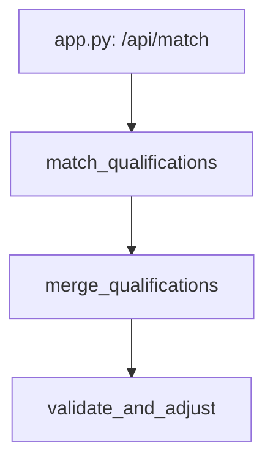

# 后端计算匹配人员数量详细流程图

## 核心函数：merge_qualifications

`merge_qualifications`函数是后端计算匹配人员数量的核心函数，位于`qualification_matcher.py`文件中。该函数负责合并多个资质的职称要求，计算最终所需的最优职称数量。

## 详细流程图

```mermaid
flowchart TD
    A[开始计算匹配人员数量] --> B[初始化最终职称计数字典]
    B --> C[分离资质类型]
    C --> D[统计职称类型出现次数]
    D --> E[找出所有有齐全要求的职称类型]
    E --> F[为有齐全要求的职称类型分配至少1人]
    F --> G[排序有齐全要求的资质]
    G --> H[遍历有齐全要求的资质]
    H --> I[计算当前已有总数]
    I --> J{当前总数 < 资质要求?}
    J -->|否| K[处理下一个资质]
    J -->|是| L[计算还需要的人数]
    L --> M[收集该资质的所有职称类型]
    M --> N[职称类型排序]
    N --> O[分配1人到优先级最高的职称类型]
    O --> P[减少需要人数]
    P --> Q[重新计算当前总数]
    Q --> R{当前总数 >= 资质要求?}
    R -->|是| K
    R -->|否| S{还需要人数 > 0?}
    S -->|是| N
    S -->|否| K
    K --> T{遍历完所有有齐全要求的资质?}
    T -->|否| H
    T -->|是| U[遍历无齐全要求的资质]
    U --> V[计算当前已有总数]
    V --> W{当前总数 < 资质要求?}
    W -->|否| X[处理下一个资质]
    W -->|是| Y[计算还需要的人数]
    Y --> Z[收集该资质的所有职称类型]
    Z --> AA[职称类型排序]
    AA --> AB[分配1人到优先级最高的职称类型]
    AB --> AC[减少需要人数]
    AC --> AD[重新计算当前总数]
    AD --> AE{当前总数 >= 资质要求?}
    AE -->|是| X
    AE -->|否| AF{还需要人数 > 0?}
    AF -->|是| AA
    AF -->|否| X
    X --> AG{遍历完所有无齐全要求的资质?}
    AG -->|否| U
    AG -->|是| AH[调用验证并调整函数]
    AH --> AI[返回最终职称计数字典]
    AI --> AJ[结束计算]

    subgraph 验证并调整函数
        AH --> BA[创建副本]
        BA --> BB[重新统计职称类型出现次数]
        BB --> BC[重新分离资质类型]
        BC --> BD[重新排序资质]
        BD --> BE[遍历有齐全要求的资质]
        BE --> BF[验证每个职称类型至少1人]
        BF --> BG[计算当前已有总数]
        BG --> BH{当前总数 < 资质要求?}
        BH -->|否| BI[处理下一个资质]
        BH -->|是| BJ[计算还需要的人数]
        BJ --> BK[职称类型排序]
        BK --> BL[分配1人到优先级最高的职称类型]
        BL --> BM[减少需要人数]
        BM --> BN[重新计算当前总数]
        BN --> BO{当前总数 >= 资质要求?}
        BO -->|是| BI
        BO -->|否| BP{还需要人数 > 0?}
        BP -->|是| BK
        BP -->|否| BI
        BI --> BQ{遍历完所有有齐全要求的资质?}
        BQ -->|否| BE
        BQ -->|是| BR[遍历无齐全要求的资质]
        BR --> BS[计算当前已有总数]
        BS --> BT{当前总数 < 资质要求?}
        BT -->|否| BU[处理下一个资质]
        BT -->|是| BV[计算还需要的人数]
        BV --> BW[职称类型排序]
        BW --> BX[分配1人到优先级最高的职称类型]
        BX --> BY[减少需要人数]
        BY --> BZ[重新计算当前总数]
        BZ --> CA{当前总数 >= 资质要求?}
        CA -->|是| BU
        CA -->|否| CB{还需要人数 > 0?}
        CB -->|是| BW
        CB -->|否| BU
        BU --> CC{遍历完所有无齐全要求的资质?}
        CC -->|否| BR
        CC -->|是| CD[最终验证]
        CD --> CE[返回调整后的职称计数字典]
        CE --> AH
    end
```



## 流程图说明

### 1. 初始化和准备阶段

- **初始化最终职称计数字典**：创建一个空字典，用于存储最终的职称数量
- **分离资质类型**：将资质分为两类
  - `all_types_qualifications`：要求职称类型齐全的资质
  - `partial_types_qualifications`：不要求职称类型齐全的资质
- **统计职称类型出现次数**：计算每个职称类型在所有资质中出现的次数，用于后续优先级排序
- **找出所有有齐全要求的职称类型**：收集所有要求齐全的资质中包含的职称类型
- **为有齐全要求的职称类型分配至少1人**：确保每个要求齐全的职称类型至少有1人

### 2. 处理有齐全要求的资质

- **排序资质**：按单个资质要求的人数从小到大排序，先处理要求人数少的资质
- **遍历每个资质**：
  - 计算当前已有该资质所需职称类型的总数
  - 如果总数不足，计算还需要的人数
  - 对该资质的职称类型进行排序（共享次数多的优先，当前数量少的优先）
  - 分配1人到优先级最高的职称类型
  - 重复上述步骤，直到满足该资质的人数要求

### 3. 处理没有齐全要求的资质

- **遍历每个资质**：
  - 计算当前已有该资质所需职称类型的总数
  - 如果总数不足，计算还需要的人数
  - 对该资质的职称类型进行排序（共享次数多的优先，当前数量少的优先）
  - 分配1人到优先级最高的职称类型
  - 重复上述步骤，直到满足该资质的人数要求

### 4. 验证和调整阶段

`validate_and_adjust`函数是一个重要的验证和调整步骤，确保所有资质要求都被满足：

- **创建副本**：创建职称计数字典的副本，避免直接修改原数据
- **重新统计和分离**：重新统计职称类型出现次数并分离资质类型
- **重新处理有齐全要求的资质**：
  - 验证每个职称类型至少1人
  - 确保总人数满足要求
  - 如有不足，进行调整
- **重新处理没有齐全要求的资质**：
  - 确保总人数满足要求
  - 如有不足，进行调整
- **最终验证**：使用断言确保所有资质要求都被满足
  - 要求齐全的资质：每个职称类型至少1人，总人数满足要求
  - 不要求齐全的资质：总人数满足要求

### 5. 返回结果

- 返回最终的职称计数字典，包含每个职称类型所需的人数

## 关键算法和策略

1. **职称类型优先级排序**：
   - 共享次数多的职称类型优先分配
   - 当前数量少的职称类型优先分配
   - 这种策略可以最大化职称共享，减少总人数

2. **资质处理顺序**：
   - 先处理要求人数少的资质
   - 先处理要求齐全的资质
   - 这种顺序可以更好地平衡各资质的要求

3. **验证机制**：
   - 多层验证确保结果正确性
   - 使用断言确保所有要求都被满足
   - 自动调整不满足要求的情况

## 函数调用关系



## 输入输出示例

### 输入
```python
# 输入：多个资质对象列表
qualifications = [
    {
        "name": "建筑总包二级",
        "require_all_types": True,
        "types": ["建筑工程", "结构工程", "电气工程", "暖通工程", "给排水工程"],
        "total_count": 15
    },
    {
        "name": "市政总包二级",
        "require_all_types": False,
        "types": ["市政工程", "结构工程", "电气工程"],
        "total_count": 10
    }
]
```

### 输出
```python
# 输出：最终职称计数字典
final_counts = {
    "建筑工程": 3,
    "结构工程": 4,
    "电气工程": 4,
    "暖通工程": 2,
    "给排水工程": 2,
    "市政工程": 2
}
# 总人数：3+4+4+2+2+2=17人
```

## 代码优化建议

1. **算法效率优化**：对于大量资质的情况，可以考虑使用更高效的算法来减少计算时间
2. **并行计算**：如果资质数量非常多，可以考虑使用并行计算来提高处理速度
3. **缓存机制**：对于频繁查询的资质组合，可以考虑添加缓存机制，避免重复计算
4. **配置化**：将一些参数（如职称类型优先级权重）配置化，方便后续调整
5. **日志记录**：添加详细的日志记录，方便调试和监控

## 总结

后端计算匹配人员数量的过程是一个复杂的优化问题，需要考虑多个因素：

1. 不同资质的职称类型要求
2. 是否要求职称类型齐全
3. 每个资质的总人数要求
4. 职称类型的共享情况
5. 最优解的计算

通过详细的流程图，我们可以清晰地看到整个计算过程的各个步骤和决策点，有助于理解系统的核心业务逻辑，为后续的维护和优化提供参考。