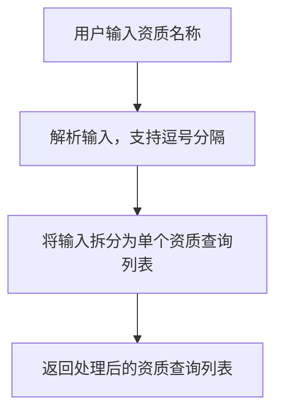
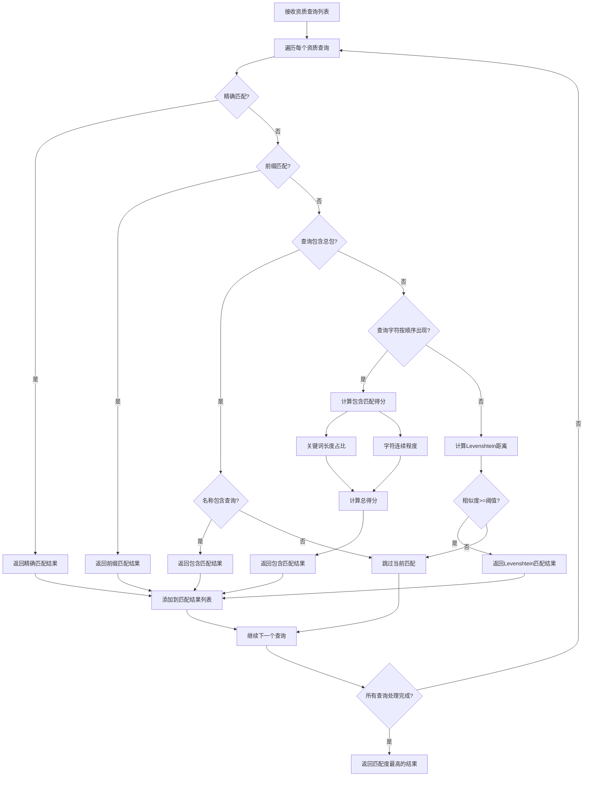
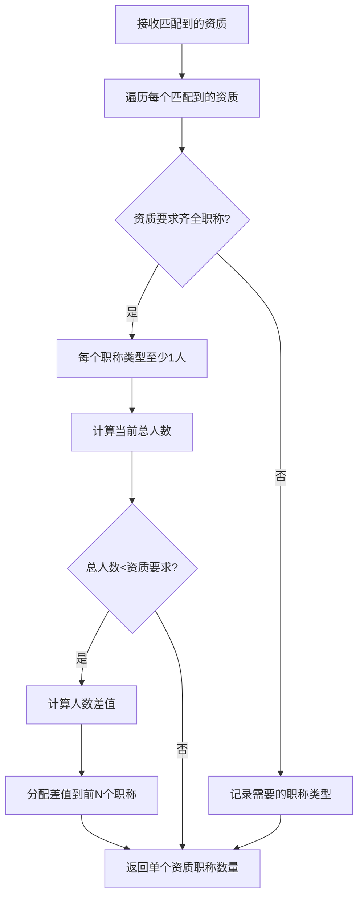
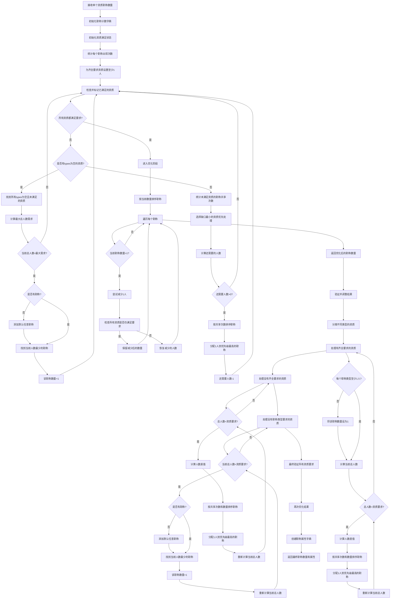
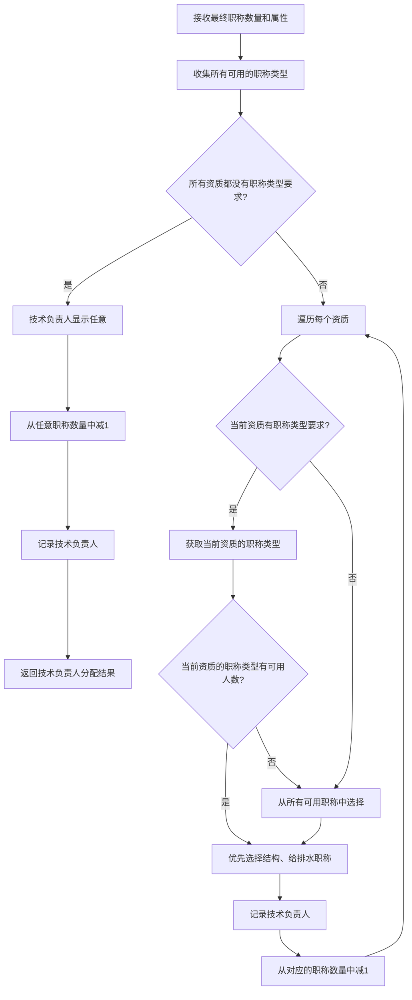
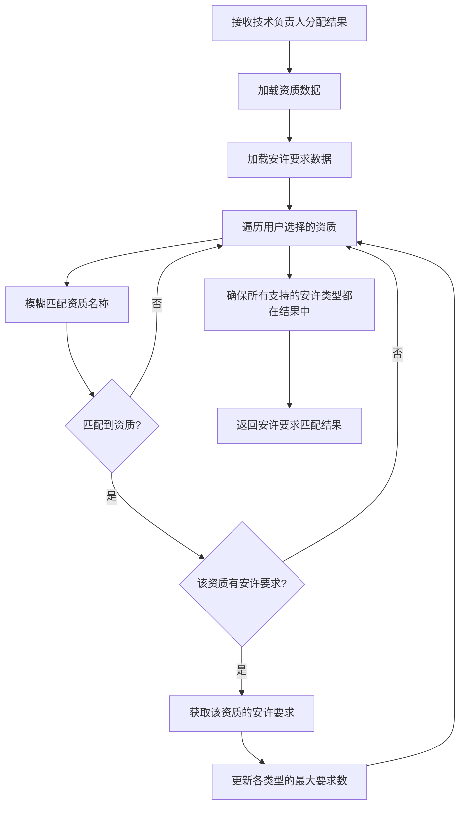
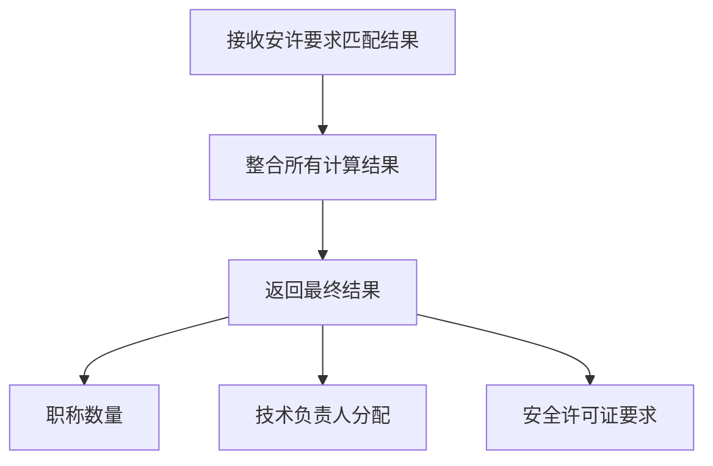

# 资质职称人员匹配算法详细分析

## 1. 算法概述

资质职称人员匹配系统是一个基于Flask的Web应用，用于根据用户输入的资质要求，自动计算所需的职称数量、技术负责人和安全许可证配置。系统采用多种匹配算法和优化策略，确保计算结果准确且高效。

## 2. 详细算法流程图

```mermaid
flowchart TD
    %% 输入处理模块
    A[用户输入资质名称] --> B[解析输入，支持逗号分隔]
    B --> C[将输入拆分为单个资质查询列表]

    %% 模糊匹配模块
    C --> D[遍历每个资质查询]
    D --> E{精确匹配?}
    E -->|是| F[返回精确匹配结果]
    E -->|否| G{前缀匹配?}
    G -->|是| H[返回前缀匹配结果]
    G -->|否| I{查询包含总包?}
    I -->|是| J{名称包含查询?}
    J -->|是| K[返回包含匹配结果]
    J -->|否| L[跳过当前匹配]
    I -->|否| M{查询字符按顺序出现?}
    M -->|是| N[计算包含匹配得分]
    N --> O[关键词长度占比]
    N --> P[字符连续程度]
    O --> Q[计算总得分]
    P --> Q
    Q --> R[返回包含匹配结果]
    M -->|否| S[计算Levenshtein距离]
    S --> T{相似度>=阈值?}
    T -->|是| U[返回Levenshtein匹配结果]
    T -->|否| V[跳过当前匹配]
    F --> W[添加到匹配结果列表]
    H --> W
    K --> W
    R --> W
    U --> W
    L --> X[继续下一个查询]
    V --> X
    W --> X
    X --> Y{所有查询处理完成?}
    Y -->|是| Z[返回匹配度最高的结果]
    Y -->|否| D

    %% 单个资质计算模块
    Z --> AA[遍历每个匹配到的资质]
    AA --> AB{资质要求齐全职称?}
    AB -->|是| AC[每个职称类型至少1人]
    AC --> AD[计算当前总人数]
    AD --> AE{总人数<资质要求?}
    AE -->|是| AF[计算人数差值]
    AF --> AG[分配差值到前N个职称]
    AG --> AH[返回单个资质职称数量]
    AE -->|否| AH
    AB -->|否| AI[记录需要的职称类型]
    AI --> AH

    %% 多资质合并模块
    AH --> AJ[初始化职称计数字典]
    AJ --> AK[初始化资质满足状态]
    AK --> AL[统计每个职称出现次数]
    AL --> AM[为齐全要求资质设置至少1人]
    AM --> AN[检查并标记已满足的资质]
    AN --> AO{所有资质都满足要求?}
    AO -->|是| AP[进入优化阶段]
    AO -->|否| AQ{是否有types为空的资质?}
    AQ -->|是| AR[找到所有types为空且未满足的资质]
    AR --> AS[计算最大总人数需求]
    AS --> AT{当前总人数<最大需求?}
    AT -->|是| AU{是否有职称?}
    AU -->|否| AV[添加默认任意职称]
    AV --> AW[找到当前人数最少的职称]
    AW --> AX[该职称数量+1]
    AX --> AN
    AU -->|是| AW
    AT -->|否| AN
    AQ -->|否| AY[统计未满足资质的职称共享次数]
    AY --> AZ[选择缺口最小的资质优先处理]
    AZ --> BA[计算还需要的人数]
    BA --> BB{还需要人数>0?}
    BB -->|是| BC[按共享次数排序职称]
    BC --> BD[分配1人到优先级最高的职称]
    BD --> BE[还需要人数-1]
    BE --> AN
    BB -->|否| AN
    AP --> BF[按当前数量排序职称]
    BF --> BG[遍历每个职称]
    BG --> BH{当前职称数量>1?}
    BH -->|是| BI[尝试减少1人]
    BI --> BJ[检查所有资质是否仍满足要求]
    BJ -->|是| BK[保留减少后的数量]
    BK --> BG
    BJ -->|否| BL[恢复减少的人数]
    BL --> BG
    BH -->|否| BG
    BG --> BM[返回优化后的职称数量]
    BM --> BN[验证并调整结果]
    BN --> BO[分离不同类型的资质]
    BO --> BP[处理有齐全要求的资质]
    BP --> BQ{每个职称类型至少1人?}
    BQ -->|否| BR[将该职称数量设为1]
    BR --> BS[计算当前总人数]
    BS --> BT{总人数<资质要求?}
    BT -->|是| BU[计算人数差值]
    BU --> BV[按共享次数和数量排序职称]
    BV --> BW[分配1人到优先级最高的职称]
    BW --> BX[重新计算当前总人数]
    BX --> BT
    BT -->|否| BP
    BQ -->|是| BS
    BP --> BY[处理没有齐全要求的资质]
    BY --> BZ{总人数<资质要求?}
    BZ -->|是| CA[计算人数差值]
    CA --> CB[按共享次数和数量排序职称]
    CB --> CC[分配1人到优先级最高的职称]
    CC --> CD[重新计算当前总人数]
    CD --> BZ
    BZ -->|否| BY
    BY --> CE[处理没有职称类型要求的资质]
    CE --> CF{当前总人数<资质要求?}
    CF -->|是| CG{是否有职称?}
    CG -->|否| CH[添加默认任意职称]
    CH --> CI[找到当前人数最少的职称]
    CI --> CJ[该职称数量+1]
    CJ --> CK[重新计算当前总人数]
    CK --> CF
    CG -->|是| CI
    CF -->|否| CE
    CE --> CL[最终验证所有资质要求]
    CL --> CM[再次优化结果]
    CM --> CN[创建职称属性字典]
    CN --> CO[返回最终职称数量和属性]

    %% 技术负责人分配模块
    CO --> CP[收集所有可用的职称类型]
    CP --> CQ{所有资质都没有职称类型要求?}
    CQ -->|是| CR[技术负责人显示任意]
    CR --> CS[从任意职称数量中减1]
    CS --> CT[记录技术负责人]
    CQ -->|否| CU[遍历每个资质]
    CU --> CV{当前资质有职称类型要求?}
    CV -->|是| CW[获取当前资质的职称类型]
    CW --> CX{当前资质的职称类型有可用人数?}
    CX -->|是| CY[优先选择结构、给排水职称]
    CY --> CZ[记录技术负责人]
    CZ --> DA[从对应的职称数量中减1]
    DA --> CU
    CX -->|否| DB[从所有可用职称中选择]
    DB --> CY
    CV -->|否| DD[从所有可用职称中选择]
    DD --> CY
    CT --> DE[返回技术负责人分配结果]

    %% 安全许可证匹配模块
    DE --> DF[加载资质数据]
    DF --> DG[加载安许要求数据]
    DG --> DH[遍历用户选择的资质]
    DH --> DI[模糊匹配资质名称]
    DI --> DJ{匹配到资质?}
    DJ -->|是| DK{该资质有安许要求?}
    DK -->|是| DL[获取该资质的安许要求]
    DL --> DM[更新各类型的最大要求数]
    DM --> DH
    DK -->|否| DH
    DJ -->|否| DH
    DH --> DN[确保所有支持的安许类型都在结果中]
    DN --> DO[返回安许要求匹配结果]

    %% 结果输出模块
    DO --> DP[返回最终结果]
    DP --> DQ[职称数量]
    DP --> DR[技术负责人分配]
    DP --> DS[安全许可证要求]
```

## 3. 核心算法详细分析

### 3.1 模糊搜索算法

#### 3.1.1 算法流程

1. **精确匹配优先**：如果查询字符串与资质名称完全匹配，返回相似度1.0
2. **前缀匹配**：如果资质名称以前缀形式包含查询字符串，返回相似度0.9
3. **包含关系匹配**：
   - 如果查询字符串包含"总包"，则只匹配完全包含该关键词的资质，返回相似度0.8
   - 否则，检查查询字符串的字符是否按顺序出现在资质名称中
   - 计算匹配得分：
     - 得分1：关键词长度占名称长度的比例
     - 得分2：关键词字符在名称中连续出现的程度（间隔越小，得分越高）
     - 总得分 = 长度得分 * 0.6 + 连续性得分 * 0.4
4. **Levenshtein距离匹配**：
   - 计算查询字符串与资质名称之间的编辑距离
   - 将编辑距离转换为0-1之间的相似度
   - 只有相似度大于等于阈值（默认0.3）才返回结果
5. **结果排序**：按相似度降序排序，返回匹配结果

#### 3.1.2 时间复杂度

- 精确匹配：O(n)，其中n是资质数量
- 前缀匹配：O(n)，其中n是资质数量
- 包含关系匹配：O(n*m)，其中n是资质数量，m是资质名称长度
- Levenshtein距离匹配：O(n*m²)，其中n是资质数量，m是资质名称长度（主要是编辑距离计算）
- 结果排序：O(n*logn)，其中n是匹配结果数量

**总时间复杂度**：O(n*m²)，其中n是资质数量，m是资质名称长度

#### 3.1.3 空间复杂度

- 匹配结果存储：O(n)，其中n是匹配结果数量
- Levenshtein距离矩阵：O(m²)，其中m是资质名称长度

**总空间复杂度**：O(n + m²)

### 3.2 单个资质计算算法

#### 3.2.1 算法流程

1. **初始化职称计数字典**
2. **如果要求齐全职称**：
   - 每个职称类型至少1人
   - 计算当前总人数
   - 如果总人数小于资质要求总人数，计算差值并优先分配到前N个职称类型
3. **如果不要求齐全职称**：
   - 记录需要的职称类型，数量初始化为0
4. **返回单个资质职称数量**

#### 3.2.2 时间复杂度

- 遍历职称类型：O(t)，其中t是职称类型数量
- 计算总人数：O(t)
- 分配差值：O(d)，其中d是人数差值

**总时间复杂度**：O(t + d)，其中t是职称类型数量，d是人数差值

#### 3.2.3 空间复杂度

- 职称计数字典：O(t)，其中t是职称类型数量

**总空间复杂度**：O(t)

### 3.3 多资质合并算法

#### 3.3.1 算法流程

1. **初始化职称计数字典和资质满足状态字典**
2. **统计每个职称在所有资质中出现的次数**
3. **对有齐全要求的资质，为其每个职称设置至少1人**
4. **检查并标记已满足的资质**
5. **循环处理，直到所有资质都满足要求**：
   - 处理types为空的资质
   - 统计当前未满足资质的职称共享次数
   - 选择当前缺口最小的资质优先处理
   - 分配人数到优先级最高的职称
   - 重新检查满足情况
6. **优化结果**：
   - 按当前数量从多到少排序职称
   - 尝试减少每个职称的人数，检查是否仍满足所有资质要求
   - 保留优化后的结果
7. **验证并调整结果**：
   - 处理有齐全要求的资质
   - 处理没有齐全要求的资质
   - 处理没有职称类型要求的资质
   - 最终验证所有资质要求
8. **再次优化结果**
9. **创建职称属性字典**
10. **返回最终职称数量和属性**

#### 3.3.2 时间复杂度

- 初始化字典：O(p + t)，其中p是资质数量，t是职称类型数量
- 统计职称出现次数：O(p*t)
- 处理有齐全要求的资质：O(p*t)
- 检查满足情况：O(p*t)
- 循环处理：O(k*p*t)，其中k是循环次数
- 优化结果：O(t*p*t) = O(p*t²)
- 验证并调整结果：O(p*t)
- 创建职称属性字典：O(t)

**总时间复杂度**：O(p*t² + k*p*t)，其中p是资质数量，t是职称类型数量，k是循环次数

#### 3.3.3 空间复杂度

- 职称计数字典：O(t)
- 资质满足状态字典：O(p)
- 临时变量：O(t)

**总空间复杂度**：O(p + t)

### 3.4 技术负责人分配算法

#### 3.4.1 算法流程

1. **收集所有可用的职称类型**
2. **如果所有资质都没有职称类型要求**：
   - 技术负责人显示"任意"
   - 从"任意"职称数量中减去1
3. **否则，遍历每个资质**：
   - 如果当前资质有职称类型要求：
     - 优先选择当前资质的职称类型
     - 如果当前资质的职称类型有可用人数，优先选择"结构"、"给排水"职称
     - 否则，从所有可用职称中选择
   - 否则，从所有可用职称中选择
   - 记录技术负责人
   - 从对应的职称数量中减去1
4. **返回技术负责人分配结果**

#### 3.4.2 时间复杂度

- 收集可用职称类型：O(p*t)
- 遍历资质：O(p)
- 选择职称类型：O(t)

**总时间复杂度**：O(p*t)

#### 3.4.3 空间复杂度

- 可用职称类型列表：O(t)
- 技术负责人分配字典：O(p)

**总空间复杂度**：O(p + t)

### 3.5 安全许可证匹配算法

#### 3.5.1 算法流程

1. **加载资质数据和安许要求数据**
2. **遍历用户选择的资质**：
   - 模糊匹配资质名称
   - 如果匹配到资质且该资质有安许要求，获取该资质的安许要求
   - 更新各类型的最大要求数
3. **确保所有支持的安许类型都在结果中**
4. **返回安许要求匹配结果**

#### 3.5.2 时间复杂度

- 加载数据：O(n + m)，其中n是资质数量，m是安许要求数量
- 遍历资质：O(p)
- 模糊匹配：O(n*m²)
- 更新安许要求：O(a)，其中a是安许类型数量

**总时间复杂度**：O(n*m² + p + a)

#### 3.5.3 空间复杂度

- 安许要求字典：O(a)，其中a是安许类型数量

**总空间复杂度**：O(a)

## 4. 整体算法复杂度分析

### 4.1 时间复杂度

整体时间复杂度由各个模块的时间复杂度叠加而成，主要瓶颈在于模糊搜索模块的Levenshtein距离计算和多资质合并模块的优化过程。

**总时间复杂度**：O(n*m² + p*t² + k*p*t)，其中：
- n是资质数量
- m是资质名称长度
- p是用户选择的资质数量
- t是职称类型数量
- k是多资质合并模块的循环次数

在实际应用中，n、m、p、t的值通常较小，因此算法的时间复杂度是可接受的。

### 4.2 空间复杂度

整体空间复杂度由各个模块的空间复杂度叠加而成，主要取决于职称类型数量和资质数量。

**总空间复杂度**：O(n + m² + p + t)，其中：
- n是资质数量
- m是资质名称长度
- p是用户选择的资质数量
- t是职称类型数量

在实际应用中，空间复杂度也是可接受的，不会造成内存溢出问题。

## 5. 算法优化建议

1. **模糊搜索优化**：
   - 可以使用更高效的字符串匹配算法，如Jaccard相似度或余弦相似度
   - 可以添加索引机制，减少需要匹配的资质数量

2. **多资质合并优化**：
   - 可以使用更智能的分配策略，减少循环次数
   - 可以使用动态规划算法，优化职称数量分配

3. **并行计算**：
   - 对于模糊搜索和多资质合并等可以并行的操作，可以考虑使用并行计算提高效率

4. **缓存机制**：
   - 可以添加缓存机制，缓存已计算的结果，减少重复计算

## 6. 板块详细流程图

### 6.1 输入处理模块流程图

### 6.2 模糊匹配模块流程图

### 6.3 单个资质计算模块流程图

### 6.4 多资质合并模块流程图

### 6.5 技术负责人分配模块流程图

### 6.6 安全许可证匹配模块流程图

### 6.7 结果输出模块流程图

## 7. 总结

资质职称人员匹配系统采用了多种匹配算法和优化策略，能够根据用户输入的资质要求，自动计算所需的职称数量、技术负责人和安全许可证配置。系统的算法流程清晰，复杂度可控，能够满足实际应用的需求。通过进一步优化，可以提高系统的性能和准确性，更好地服务于用户。
