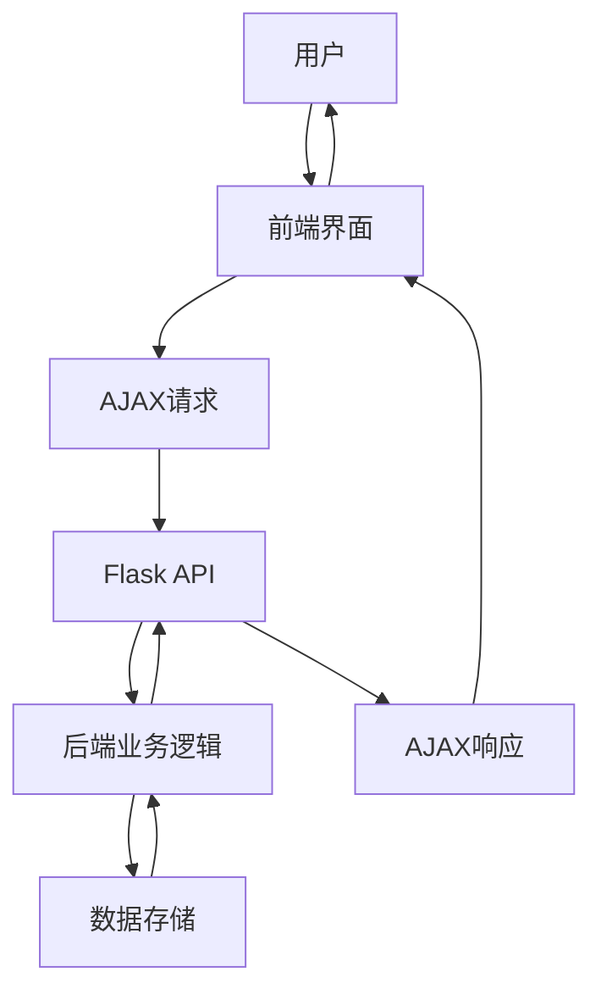

# 项目整体流程图

## 项目概述

本项目是一个资质职称匹配查询系统，采用前后端分离架构。前端使用HTML、CSS和JavaScript实现，后端使用Flask框架实现。系统主要功能包括资质搜索、资质选择、职称数量计算和结果展示。

## 流程图说明

- **前端部分**：使用浅蓝色背景（`#E6F3FF`）表示
- **后端部分**：使用浅绿色背景（`#E6FFE6`）表示
- **数据存储**：使用浅黄色背景（`#FFFBE6`）表示

## 详细流程图

```mermaid
flowchart TD
    %% 前端流程
    A[用户访问系统] --> B[加载HTML页面]
    B --> C[加载CSS资源]
    C --> D[加载JavaScript资源]
    D --> E[初始化变量和事件监听器]
    E --> F[页面加载完成]
    F --> G[用户输入搜索关键词]
    G --> H{输入长度>=1?}
    H -->|否| I[清空搜索结果]
    H -->|是| J[发送AJAX搜索请求]
    K[用户选择搜索结果] --> L[添加资质到已选择列表]
    L --> M[清空搜索输入和结果]
    M --> N[渲染已选择的资质]
    N --> O[用户点击计算按钮]
    O --> P{已选择资质数量>0?}
    P -->|否| Q[弹出提示框]
    P -->|是| R[显示加载状态]
    R --> S[发送AJAX计算请求]
    T[处理搜索结果] --> U[过滤已选择的资质]
    U --> V[渲染搜索结果列表]
    V --> K
    W[处理计算响应] --> X[隐藏加载状态]
    X --> Y[保存匹配到的资质详情]
    Y --> Z[显示结果区域]
    Z --> AA[渲染匹配到的资质]
    AA --> AB[渲染所需职称数量列表]
    AB --> AC[渲染总人数]
    AC --> AD[用户点击查看资质要求]
    AD --> AE{已保存资质详情?}
    AE -->|否| AF[弹出提示框]
    AE -->|是| AG[渲染资质要求详情]
    AG --> AH[显示模态框]
    AH --> AI[用户关闭模态框]
    AI --> AJ[用户继续操作]
    AJ --> AK{用户操作}
    AK -->|清空选择| AL[清空已选择的资质]
    AL --> AM[隐藏结果区域]
    AM --> F
    AK -->|重新搜索| F
    AK -->|退出系统| AN[结束]
    Q --> F
    AF --> F
    I --> F

    %% 后端搜索处理流程
    J --> BA[Flask接收搜索请求]
    BA --> BB[加载资质数据]
    BB --> BC[读取资质数据文件]
    BC --> BD[进行模糊搜索]
    BD --> BE{精确匹配?}
    BE -->|是| BF[添加到结果]
    BE -->|否| BG{前缀匹配?}
    BG -->|是| BH[添加到结果]
    BG -->|否| BI{包含总包?}
    BI -->|是| BJ{完全包含?}
    BJ -->|是| BK[添加结果]
    BJ -->|否| BL[跳过]
    BI -->|否| BM{字符顺序匹配?}
    BM -->|是| BN[计算匹配得分]
    BN --> BO[添加到结果]
    BM -->|否| BP[计算相似度]
    BP --> BQ{相似度>=阈值?}
    BQ -->|是| BR[添加到结果]
    BQ -->|否| BS[跳过]
    BF --> BT[结果排序]
    BH --> BT
    BK --> BT
    BO --> BT
    BR --> BT
    BL --> BT
    BS --> BT
    BT --> BU[返回搜索结果]
    BU --> T

    %% 后端计算处理流程
    S --> BV[Flask接收计算请求]
    BV --> BW[加载资质数据]
    BW --> BX[读取资质数据文件]
    BX --> BY[获取匹配的资质信息]
    BY --> BZ[合并资质]
    BZ --> CA[初始化最终职称计数字典]
    CA --> CB[分离资质类型]
    CB --> CC[统计职称类型出现次数]
    CC --> CD[找出所有有齐全要求的职称类型]
    CD --> CE[为有齐全要求的职称类型分配至少1人]
    CE --> CF[排序有齐全要求的资质]
    CF --> CG[遍历有齐全要求的资质]
    CG --> CH[计算当前已有总数]
    CH --> CI{当前总数 < 资质要求?}
    CI -->|否| CJ[处理下一个资质]
    CI -->|是| CK[计算还需要的人数]
    CK --> CL[收集该资质的所有职称类型]
    CL --> CM[职称类型排序]
    CM --> CN[分配1人到优先级最高的职称类型]
    CN --> CO[减少需要人数]
    CO --> CP[重新计算当前总数]
    CP --> CQ{当前总数 >= 资质要求?}
    CQ -->|是| CJ
    CQ -->|否| CR{还需要人数 > 0?}
    CR -->|是| CM
    CR -->|否| CJ
    CJ --> CS{遍历完所有有齐全要求的资质?}
    CS -->|否| CG
    CS -->|是| CT[遍历无齐全要求的资质]
    CT --> CU[计算当前已有总数]
    CU --> CV{当前总数 < 资质要求?}
    CV -->|否| CW[处理下一个资质]
    CV -->|是| CX[计算还需要的人数]
    CX --> CY[收集该资质的所有职称类型]
    CY --> CZ[职称类型排序]
    CZ --> DA[分配1人到优先级最高的职称类型]
    DA --> DB[减少需要人数]
    DB --> DC[重新计算当前总数]
    DC --> DD{当前总数 >= 资质要求?}
    DD -->|是| CW
    DD -->|否| DE{还需要人数 > 0?}
    DE -->|是| CZ
    DE -->|否| CW
    CW --> DF{遍历完所有无齐全要求的资质?}
    DF -->|否| CT
    DF -->|是| DG[验证并调整职称数量]
    DG --> DH[创建副本]
    DH --> DI[重新统计职称类型出现次数]
    DI --> DJ[重新分离资质类型]
    DJ --> DK[重新排序资质]
    DK --> DL[遍历有齐全要求的资质]
    DL --> DM[验证每个职称类型至少1人]
    DM --> DN[计算当前已有总数]
    DN --> DO{当前总数 < 资质要求?}
    DO -->|否| DP[处理下一个资质]
    DO -->|是| DQ[计算还需要的人数]
    DQ --> DR[职称类型排序]
    DR --> DS[分配1人到优先级最高的职称类型]
    DS --> DT[减少需要人数]
    DT --> DU[重新计算当前总数]
    DU --> DV{当前总数 >= 资质要求?}
    DV -->|是| DP
    DV -->|否| DW{还需要人数 > 0?}
    DW -->|是| DR
    DW -->|否| DP
    DP --> DX{遍历完所有有齐全要求的资质?}
    DX -->|否| DL
    DX -->|是| DY[遍历无齐全要求的资质]
    DY --> DZ[计算当前已有总数]
    DZ --> EA{当前总数 < 资质要求?}
    EA -->|否| EB[处理下一个资质]
    EA -->|是| EC[计算还需要的人数]
    EC --> ED[职称类型排序]
    ED --> EE[分配1人到优先级最高的职称类型]
    EE --> EF[减少需要人数]
    EF --> EG[重新计算当前总数]
    EG --> EH{当前总数 >= 资质要求?}
    EH -->|是| EB
    EH -->|否| EI{还需要人数 > 0?}
    EI -->|是| ED
    EI -->|否| EB
    EB --> EJ{遍历完所有无齐全要求的资质?}
    EJ -->|否| DY
    EJ -->|是| EK[最终验证]
    EK --> EL[返回调整后的职称计数字典]
    EL --> EM[计算总人数]
    EM --> EN[返回计算结果]
    EN --> W

    %% 数据更新流程
    EP[数据更新脚本] --> EQ[读取Excel数据]
    EQ --> ER[解析Excel数据]
    ER --> ES[读取现有资质数据文件]
    ES --> ET[对比数据]
    ET -->|存在差异| EU[更新或添加资质数据]
    ET -->|无差异| EV[跳过]
    EU --> EW{检查是否需要删除}
    EW -->|需要删除| EX[删除Excel中不存在的资质]
    EW -->|不需要删除| EY[保存更新后的资质数据文件]
    EX --> EY
    EY --> EZ[数据更新完成]

    %% 设置样式
    classDef frontend fill:#E6F3FF,stroke:#333,stroke-width:2px;
    classDef backend fill:#E6FFE6,stroke:#333,stroke-width:2px;
    classDef data fill:#FFFBE6,stroke:#333,stroke-width:2px;

    %% 应用样式 - 前端节点
    class A,B,C,D,E,F,G,H,I,J,K,L,M,N,O,P,Q,R,S,T,U,V,W,X,Y,Z,AA,AB,AC,AD,AE,AF,AG,AH,AI,AJ,AK,AL,AM,AN frontend;

    %% 应用样式 - 后端节点
    class BA,BB,BD,BE,BF,BG,BH,BI,BJ,BK,BL,BM,BN,BO,BP,BQ,BR,BS,BT,BU,BV,BW,BY,BZ,CA,CB,CC,CD,CE,CF,CG,CH,CI,CK,CL,CM,CN,CO,CP,CQ,CR,CJ,CS,CT,CU,CV,CX,CY,CZ,DA,DB,DC,DD,DE,DF,DG,DH,DI,DJ,DK,DL,DM,DN,DO,DQ,DR,DS,DT,DU,DV,DW,DP,DX,DY,DZ,EA,EB,EC,ED,EE,EF,EG,EH,EI,EJ,EK,EL,EM,EN backend;

    %% 应用样式 - 数据存储节点
    class BC,BX,EP,EQ,ER,ES,ET,EU,EV,EW,EX,EY,EZ data;
```

## 流程图详细说明

### 1. 系统初始化流程

**前端**：
- 用户访问系统
- 加载HTML、CSS和JavaScript资源
- 初始化变量和事件监听器
- 页面加载完成，等待用户操作

### 2. 搜索功能流程

**前端**：
- 用户输入搜索关键词
- 检查输入长度，若>=1则发送AJAX搜索请求到`/api/search`

**后端**：
- Flask接收搜索请求
- 调用`load_qualification_data`函数加载资质数据
- 读取`qualification_data.json`文件
- 调用`fuzzy_search`函数进行模糊搜索
  - 精确匹配优先
  - 前缀匹配
  - 包含关系匹配（处理"建筑二"匹配"建筑总包二级"等情况）
  - Levenshtein相似度计算
- 结果排序
- 返回搜索结果

**前端**：
- 处理搜索结果，过滤已选择的资质
- 渲染搜索结果列表
- 用户选择搜索结果
- 添加资质到已选择列表
- 清空搜索输入和结果
- 渲染已选择的资质

### 3. 计算功能流程

**前端**：
- 用户点击"计算所需职称数量"按钮
- 检查已选择资质数量，若>0则显示加载状态
- 发送AJAX计算请求到`/api/match`

**后端**：
- Flask接收计算请求
- 调用`load_qualification_data`函数加载资质数据
- 读取`qualification_data.json`文件
- 获取匹配的资质信息
- 调用`merge_qualifications`函数合并资质
  - 初始化最终职称计数字典
  - 分离资质类型
  - 统计职称类型出现次数
  - 为有齐全要求的职称类型分配至少1人
  - 按单个要求人数排序资质
  - 处理有齐全要求的资质
  - 处理没有齐全要求的资质
  - 调用`validate_and_adjust`函数验证并调整职称数量
    - 创建副本
    - 重新统计和分离
    - 重新处理资质
    - 最终验证
- 调用`calculate_total_staff`函数计算总人数
- 返回计算结果

**前端**：
- 处理计算响应，隐藏加载状态
- 保存匹配到的资质详情
- 显示结果区域
- 渲染匹配到的资质
- 渲染所需职称数量列表
- 渲染总人数

### 4. 详情查看流程

**前端**：
- 用户点击"查看资质要求"按钮
- 检查是否已保存资质详情，若已保存则渲染资质要求详情
- 显示模态框，展示资质的详细要求
- 用户关闭模态框，继续操作

### 5. 数据更新流程

**数据存储**：
- 运行`update_qualification_data.py`脚本
- 读取`zivi_data.xlsx`文件
- 解析Excel数据，提取资质信息
- 读取现有JSON数据`qualification_data.json`
- 对比数据
- 更新或添加资质数据
- 删除Excel中不存在的资质
- 保存更新后的JSON数据
- 数据更新完成

## 核心功能模块

| 模块 | 主要功能 | 实现文件 | 类型 |
|------|----------|----------|------|
| 前端页面 | 页面展示和用户交互 | templates/index.html | 前端 |
| 模糊搜索 | 实现资质名称的模糊搜索 | fuzzy_search.py | 后端 |
| 资质匹配计算 | 合并多个资质的职称要求，计算最优职称数量 | qualification_matcher.py | 后端 |
| 数据管理 | 从Excel更新资质数据到JSON文件 | update_qualification_data.py | 数据存储 |
| 后端API | 提供搜索和计算的API接口 | app.py | 后端 |

## 技术栈

| 类别 | 技术 | 版本 | 用途 |
|------|------|------|------|
| 前端 | HTML5 | 最新 | 页面结构 |
| 前端 | CSS3 | 最新 | 页面样式 |
| 前端 | JavaScript | ES6+ | 交互逻辑 |
| 前端 | Bootstrap | 5.3+ | UI组件库 |
| 后端 | Python | 3.12+ | 主要开发语言 |
| 后端 | Flask | 最新 | Web服务框架 |
| 数据处理 | Pandas | 最新 | Excel数据处理 |
| 数据存储 | JSON | - | 资质数据存储 |
| 数据存储 | Excel | - | 资质数据源 |

## 系统特点

1. **前后端分离**：前端和后端独立开发、部署，提高开发效率和系统可维护性
2. **智能模糊搜索**：支持多种匹配方式，提高搜索准确性和用户体验
3. **最优解计算**：考虑职称共享，最小化总人数，节约成本
4. **灵活的资质管理**：支持从Excel更新数据，方便维护
5. **直观的结果展示**：清晰展示所需职称类型和数量
6. **响应式设计**：适配不同设备，提供良好的移动端体验
7. **多层验证机制**：确保计算结果的正确性

## 数据流向

## 优化建议

1. **添加缓存机制**：在后端添加缓存机制，减少对文件系统的访问，提高响应速度
2. **使用CDN加速**：将静态资源部署到CDN，提高资源加载速度
3. **添加请求限流**：防止恶意请求导致系统过载
4. **使用HTTPS**：确保数据传输的安全性
5. **添加日志记录**：记录系统运行日志，便于调试和监控
6. **使用WebSocket**：对于需要实时更新的数据，考虑使用WebSocket替代AJAX
7. **优化数据库访问**：如果未来数据量增大，考虑使用数据库替代JSON文件存储
8. **算法优化**：优化模糊搜索和资质合并算法，提高计算效率

## 总结

本流程图详细展示了资质职称匹配查询系统的整体运行流程，包括前端交互、后端处理和数据存储。通过不同的背景色清晰区分了前端、后端和数据存储部分，便于理解系统的整体架构和工作原理。

该流程图涵盖了系统的所有核心功能，包括搜索功能、计算功能、详情查看功能和数据更新功能，完整地展示了用户从访问系统到查看结果的整个过程，以及后端内部的详细运行逻辑。

这份流程图可以帮助开发人员和用户更好地理解系统的工作原理，为后续的系统维护和优化提供参考。