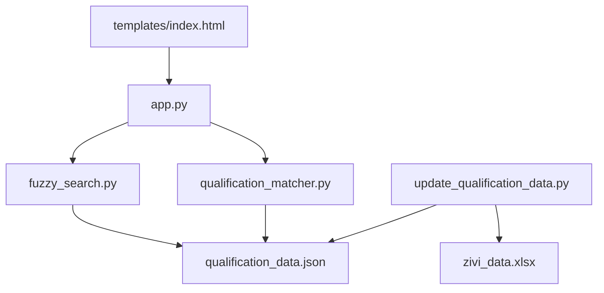
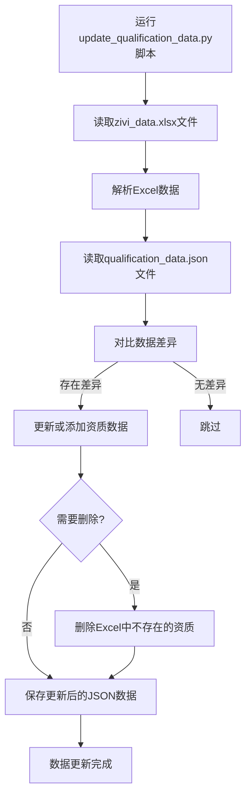
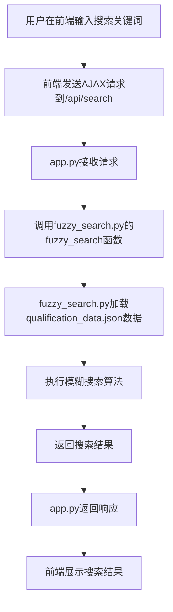
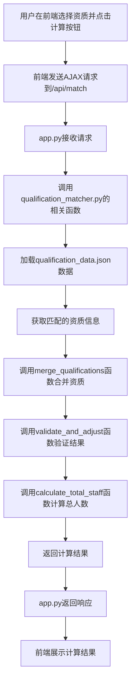

# 项目文件关系分析

## 项目概述

本项目是一个资质职称匹配查询系统，采用前后端分离架构。前端使用HTML、CSS和JavaScript实现，后端使用Flask框架实现。系统主要功能包括资质搜索、资质选择、职称数量计算和结果展示。

## 项目目录结构

```
pipei/
├── app.py                    # Flask后端服务，提供API接口
├── fuzzy_search.py           # 实现模糊搜索功能
├── qualification_matcher.py  # 资质匹配和合并计算
├── update_qualification_data.py  # 从Excel更新资质数据
├── qualification_data.json   # 资质数据存储文件
├── zivi_data.xlsx            # 资质数据源文件
├── templates/
│   └── index.html            # 前端页面
│   └── verify.html           # 前端页面2
└── __pycache__/              # Python编译缓存目录
```

## 文件关系图



## 文件依赖关系表

| 文件 | 依赖文件 | 依赖类型 | 作用 |
|------|----------|----------|------|
| app.py | fuzzy_search.py | 直接依赖 | 使用模糊搜索功能 |
| app.py | qualification_matcher.py | 直接依赖 | 使用资质匹配计算功能 |
| fuzzy_search.py | qualification_data.json | 数据依赖 | 加载资质数据 |
| qualification_matcher.py | qualification_data.json | 数据依赖 | 加载资质数据 |
| update_qualification_data.py | zivi_data.xlsx | 数据依赖 | 读取原始资质数据 |
| update_qualification_data.py | qualification_data.json | 数据依赖 | 读取和写入资质数据 |
| templates/index.html | app.py | 服务依赖 | 调用后端API接口 |

## 各文件详细说明

### 1. app.py

**类型**：后端服务入口文件

**主要功能**：
- 提供Flask Web服务
- 定义API接口
- 处理前端请求
- 返回响应结果

**API接口**：
- `/api/search`：模糊搜索资质
- `/api/match`：计算所需职称数量
- `/api/qualifications`：获取所有资质

**操作意义**：
- 启动后端服务，监听HTTP请求
- 连接前端和后端业务逻辑
- 提供统一的API访问入口

**效果**：
- 前端可以通过AJAX调用API接口
- 后端业务逻辑被封装，便于维护
- 支持跨域请求，实现前后端分离

### 2. fuzzy_search.py

**类型**：后端业务逻辑文件

**主要功能**：
- 实现模糊搜索算法
- 加载资质数据
- 处理搜索请求
- 返回匹配结果

**核心函数**：
- `load_qualification_data()`：加载资质数据
- `calculate_jaccard_similarity()`：计算Jaccard相似度
- `calculate_levenshtein_distance()`：计算Levenshtein距离
- `fuzzy_search()`：模糊搜索资质名称

**操作意义**：
- 实现智能模糊搜索，提高用户体验
- 支持多种匹配方式，提高搜索准确性
- 封装搜索逻辑，便于维护和扩展

**效果**：
- 用户输入关键词，返回匹配的资质列表
- 支持精确匹配、前缀匹配、包含关系匹配等
- 搜索结果按匹配度排序

### 3. qualification_matcher.py

**类型**：后端业务逻辑文件

**主要功能**：
- 实现资质合并算法
- 计算所需职称数量
- 验证计算结果
- 返回最终结果

**核心函数**：
- `merge_qualifications()`：合并多个资质的职称要求
- `validate_and_adjust()`：验证并调整职称数量
- `get_qualification_by_name()`：根据名称获取资质信息
- `calculate_total_staff()`：计算总人数

**操作意义**：
- 合并多个资质的职称要求，计算最优解
- 考虑职称共享，减少总人数
- 确保计算结果满足所有资质要求

**效果**：
- 输入多个资质，返回所需的职称数量
- 优化职称分配，最小化总人数
- 验证结果正确性，确保满足所有要求

### 4. update_qualification_data.py

**类型**：数据更新脚本

**主要功能**：
- 从Excel文件读取资质数据
- 解析Excel数据
- 更新资质数据到JSON文件
- 处理数据差异

**核心函数**：
- `read_excel_data()`：读取Excel数据
- `read_json_data()`：读取JSON数据
- `save_json_data()`：保存JSON数据
- `update_qualification_data()`：更新资质数据

**操作意义**：
- 保持资质数据的最新状态
- 支持从Excel批量更新数据
- 自动处理数据差异，减少人工操作

**效果**：
- 资质数据与Excel数据源保持同步
- 自动添加、更新和删除资质数据
- 确保数据的一致性和完整性

### 5. qualification_data.json

**类型**：数据存储文件

**主要功能**：
- 存储资质数据
- 提供数据访问接口
- 支持快速读取

**数据结构**：
```json
[
  {
    "name": "建筑总包二级",
    "require_all_types": true,
    "types": ["建筑工程", "结构工程", "电气工程", "暖通工程", "给排水工程"],
    "total_count": 15
  }
]
```

**操作意义**：
- 为后端提供资质数据支持
- 存储资质的详细信息，包括名称、要求、职称类型等
- 支持快速读取，提高系统性能

**效果**：
- 后端可以快速加载资质数据
- 数据结构清晰，便于维护
- 支持多种数据操作，如查询、更新等

### 6. zivi_data.xlsx

**类型**：数据源文件

**主要功能**：
- 存储原始资质数据
- 提供数据更新来源
- 支持Excel编辑

**数据结构**：
- 包含资质名称、要求、职称类型等信息
- 使用表格形式存储，便于编辑和维护

**操作意义**：
- 提供资质数据的原始来源
- 支持批量编辑和更新
- 便于非技术人员维护数据

**效果**：
- 资质数据可以通过Excel进行管理
- 支持批量导入和更新
- 减少数据维护的技术门槛

### 7. templates/index.html

**类型**：前端页面文件

**主要功能**：
- 提供用户交互界面
- 实现搜索功能
- 实现资质选择功能
- 实现结果展示功能

**核心功能模块**：
- 搜索输入框和结果展示
- 已选择资质管理
- 计算按钮和加载状态
- 结果展示区域
- 资质要求详情模态框

**操作意义**：
- 提供友好的用户界面
- 实现前端交互逻辑
- 调用后端API接口
- 展示计算结果

**效果**：
- 用户可以通过页面进行资质搜索和选择
- 实时展示搜索结果和计算结果
- 提供详细的资质要求查看功能
- 支持响应式设计，适配不同设备

## 文件交互流程

### 1. 数据更新流程



### 2. 搜索功能流程



### 3. 计算功能流程



## 项目运行流程

1. **数据准备**：运行`update_qualification_data.py`脚本，从Excel文件更新资质数据到JSON文件
2. **启动后端服务**：运行`python3 app.py`命令，启动Flask后端服务
3. **访问前端页面**：在浏览器中访问`http://localhost:5001`，加载前端页面
4. **搜索资质**：在搜索框中输入关键词，前端发送请求到后端，后端返回匹配结果
5. **选择资质**：用户选择需要的资质，添加到已选择列表
6. **计算职称数量**：点击"计算所需职称数量"按钮，前端发送请求到后端，后端计算所需职称数量并返回结果
7. **查看结果**：前端展示计算结果，用户可以查看详细的资质要求

## 项目特点

1. **前后端分离**：前端和后端独立开发、部署，提高开发效率
2. **模块化设计**：各功能模块封装在不同文件中，便于维护和扩展
3. **智能模糊搜索**：支持多种匹配方式，提高搜索准确性和用户体验
4. **最优解计算**：考虑职称共享，最小化总人数，节约成本
5. **灵活的数据管理**：支持从Excel更新资质数据，便于维护
6. **响应式设计**：前端页面适配不同设备尺寸

## 总结

本项目采用模块化设计，各文件之间职责明确，依赖关系清晰。通过分析各文件的功能、依赖关系和交互流程，可以更好地理解项目的整体架构和工作原理。

- **app.py**是后端服务的核心，连接前端和后端业务逻辑
- **fuzzy_search.py**和**qualification_matcher.py**实现了核心业务逻辑
- **update_qualification_data.py**负责数据更新和维护
- **qualification_data.json**和**zivi_data.xlsx**是数据存储和数据源
- **templates/index.html**是前端交互界面

这种模块化设计使得项目易于维护和扩展，各模块可以独立开发和测试，提高了开发效率和代码质量。