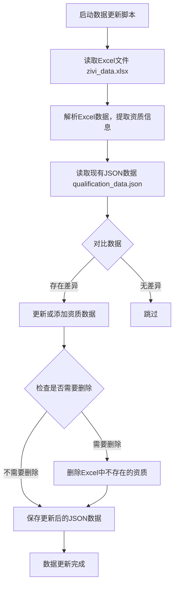
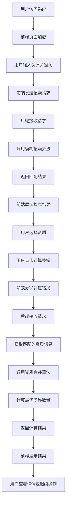
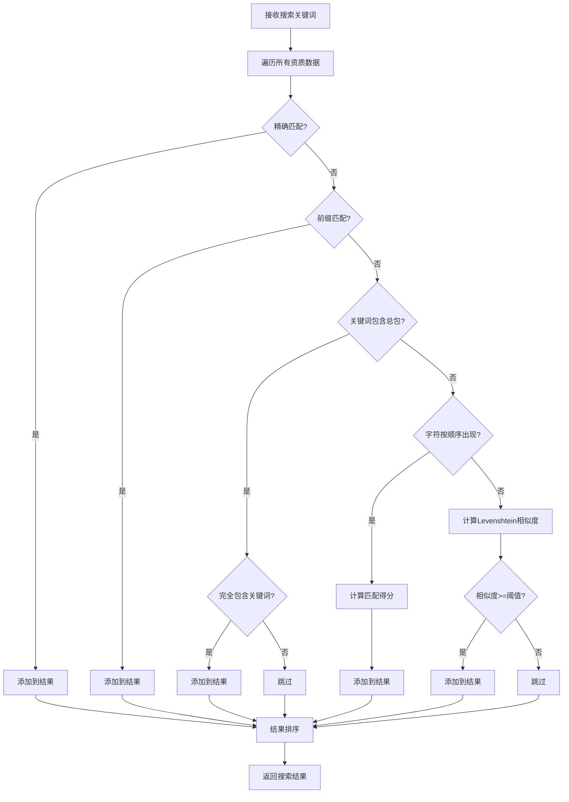
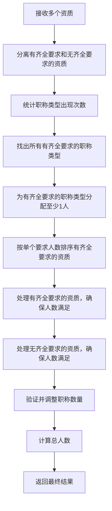

# 资质职称匹配查询系统 - 项目流程图

## 1. 项目概述

这是一个资质职称匹配查询系统，用于根据用户选择的资质，计算所需的最优职称数量。系统会考虑多个资质之间的职称共享，以最小化总人数。

## 2. 项目架构

```
┌─────────────────────────────────────────────────────────────────────┐
│                         前端界面 (HTML/CSS/JS)                     │
└─────────────────────────────────────────────────────────────────────┘
                                      │
                                      ▼
┌─────────────────────────────────────────────────────────────────────┐
│                         后端服务 (Flask API)                        │
├─────────────────────────────────────────────────────────────────────┤
│  ┌─────────────┐  ┌──────────────────┐  ┌───────────────────────┐  │
│  │  模糊搜索   │  │  资质匹配计算    │  │  数据加载与管理        │  │
│  └─────────────┘  └──────────────────┘  └───────────────────────┘  │
└─────────────────────────────────────────────────────────────────────┘
                                      │
                                      ▼
┌─────────────────────────────────────────────────────────────────────┐
│                         数据存储层                                  │
├─────────────────────────────────────────────────────────────────────┤
│  ┌─────────────────────────┐  ┌─────────────────────────────┐      │
│  │  qualification_data.json│  │  zivi_data.xlsx             │      │
│  └─────────────────────────┘  └─────────────────────────────┘      │
└─────────────────────────────────────────────────────────────────────┘
```

## 3. 核心流程

### 3.1 数据更新流程



### 3.2 资质匹配查询流程



### 3.3 模糊搜索算法流程



### 3.4 资质合并计算流程



## 4. 核心功能模块

### 4.1 数据管理模块

| 功能 | 描述 | 实现文件 |
|------|------|----------|
| 读取Excel数据 | 从zivi_data.xlsx读取资质数据 | update_qualification_data.py |
| 解析Excel数据 | 提取资质名称、要求、职称类型等信息 | update_qualification_data.py |
| 更新JSON数据 | 将Excel数据更新到qualification_data.json | update_qualification_data.py |
| 加载资质数据 | 从JSON文件加载资质数据供查询使用 | fuzzy_search.py |

### 4.2 模糊搜索模块

| 功能 | 描述 | 实现文件 |
|------|------|----------|
| 精确匹配 | 完全匹配资质名称 | fuzzy_search.py |
| 前缀匹配 | 匹配资质名称前缀 | fuzzy_search.py |
| 包含关系匹配 | 处理"建筑二"匹配"建筑总包二级"等情况 | fuzzy_search.py |
| Levenshtein相似度 | 计算字符串编辑距离，实现模糊匹配 | fuzzy_search.py |

### 4.3 资质匹配计算模块

| 功能 | 描述 | 实现文件 |
|------|------|----------|
| 单个资质计算 | 计算单个资质所需的职称数量 | qualification_matcher.py |
| 资质合并 | 合并多个资质的职称要求，计算最优解 | qualification_matcher.py |
| 职称数量验证 | 确保所有资质要求都被满足 | qualification_matcher.py |
| 总人数计算 | 计算所需的总人数 | qualification_matcher.py |

### 4.4 前端交互模块

| 功能 | 描述 | 实现文件 |
|------|------|----------|
| 搜索输入 | 接收用户输入，触发搜索 | templates/index.html |
| 结果展示 | 展示搜索结果，支持点击选择 | templates/index.html |
| 资质选择 | 管理用户选择的资质，支持添加删除 | templates/index.html |
| 计算请求 | 发送计算请求，处理响应 | templates/index.html |
| 结果可视化 | 直观展示所需职称类型和数量 | templates/index.html |

## 5. 数据结构

### 5.1 资质数据结构

```json
{
  "name": "建筑总包二级",
  "require_all_types": true,
  "types": ["建筑工程", "结构工程", "电气工程", "暖通工程", "给排水工程"],
  "total_count": 15
}
```

| 字段 | 类型 | 描述 |
|------|------|------|
| name | string | 资质名称 |
| require_all_types | boolean | 是否要求职称类型齐全 |
| types | array | 所需职称类型列表 |
| total_count | integer | 所需总人数 |

### 5.2 计算结果数据结构

```json
{
  "matched_qualifications": ["建筑总包二级", "市政总包二级"],
  "matched_qualifications_details": [...],
  "final_counts": {
    "建筑工程": 3,
    "结构工程": 2,
    "电气工程": 2,
    "暖通工程": 1,
    "给排水工程": 1,
    "市政工程": 2
  },
  "total_staff": 11
}
```

## 6. 技术栈

| 类别 | 技术 | 版本 | 用途 |
|------|------|------|------|
| 后端 | Python | 3.12+ | 主要开发语言 |
| 框架 | Flask | 最新 | Web服务框架 |
| 数据处理 | Pandas | 最新 | Excel数据处理 |
| 前端 | HTML5 | 最新 | 页面结构 |
| 前端 | CSS3 | 最新 | 页面样式 |
| 前端 | JavaScript | ES6+ | 交互逻辑 |
| 前端 | Bootstrap | 5.3+ | UI组件库 |
| 数据存储 | JSON | - | 资质数据存储 |
| 数据存储 | Excel | - | 资质数据源 |

## 7. 系统特点

1. **智能模糊搜索**：支持多种匹配方式，提高搜索准确性和用户体验
2. **最优解计算**：考虑职称共享，最小化总人数，节约成本
3. **灵活的资质管理**：支持从Excel更新数据，方便维护
4. **直观的结果展示**：清晰展示所需职称类型和数量
5. **响应式设计**：适配不同设备，提供良好的移动端体验
6. **易于扩展**：模块化设计，方便添加新功能

## 8. 应用场景

1. **建筑企业资质申请**：计算申请多个资质所需的职称人员数量
2. **资质维护管理**：定期检查现有职称人员是否满足资质要求
3. **人员招聘规划**：根据资质需求，制定招聘计划
4. **资质升级评估**：评估升级资质所需增加的职称人员数量

## 9. 未来扩展方向

1. **支持更多资质类型**：扩展到更多行业的资质匹配
2. **AI优化匹配算法**：使用机器学习优化匹配结果
3. **历史数据统计**：添加数据统计和分析功能
4. **导出功能**：支持导出计算结果到Excel或PDF
5. **用户管理**：添加用户登录和权限管理
6. **API接口**：提供开放API，支持第三方系统集成